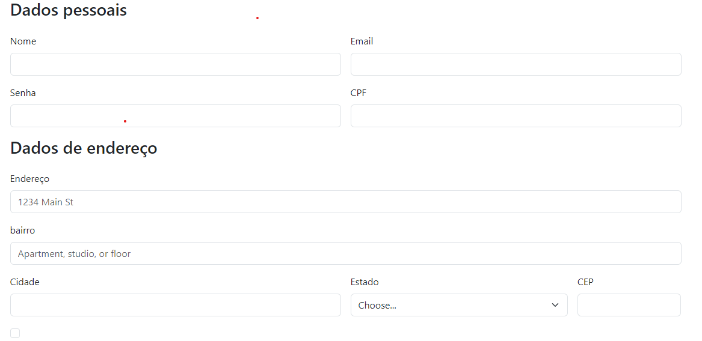

# Projeto -Cadastro de E-commerce
Na primeira atividade, pesquisei 3 sites para pegar referençias de cadastros

Os seguintes sites são:

## AMERICANAS

Na Americanas os campos indetificados foram:

  * CADASTRO DA CONTA

* Nome completo
* Gênero
* Data de Nascimento 
* CPF
* Telefone
* e-mail/senha

  * CADASTRO DA CONTA

* CEP 

## SHOPEE

Na shopee os campos indentificados foram:

  * CADASTRO DA CONTA

* Número de telefone
* Varificação de número
* Criar senha

   * CADASTRO DE COMPRA

* Nome completo
* Número de telefone
* CEP
* ESTADO-CIDADE
* Bairro
* Rua/Avenida-número
* Complemento
* Salvar como casa ou trabalho

## CASAS BAHIA

Na Casas Bahia os campos indentificados foram:

  * CADASTRO DA CONTA

* CPF ou CNPJ
* Nome
* Celular com add
* Data de nascimento com dia/mês/ano
* Gênero
* Email
* Senha
* Cep
* Ponto de referência
* Tipo de endereço destinatário

## Formulário de cadastro de E-commerce
 
  No meu formulário peguei 3 referencias de sites para ajudar no desenvolvimento dele 
  
  * Nome 
  * E-mail
  * Senha
  * CPF
  * Endereço
  * Bairro
  * Cidade
  * Estado
  * CEP
  

